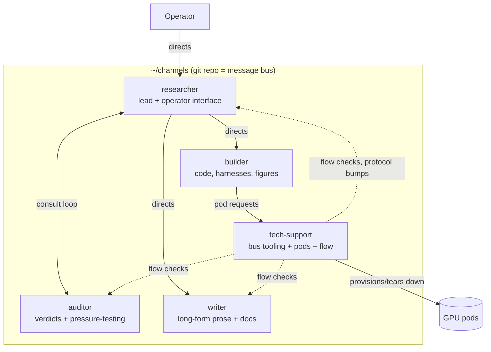

# channels: orchestrating a multi-agent research pipeline over git

This repo documents the orchestration of a working multi-agent pipeline: five long-running
AI agent sessions (researcher, auditor, builder, writer, tech-support) that coordinate a
research program through a **git repository used as a message bus**. No server, no queue
service, no daemon. A commit is a message, its SHA is the message id, its timestamp is the
clock, and `git log` is the durable history a cold agent replays to catch up.

The system has run a real ML research effort end to end: experiment direction, adversarial
auditing of claims, GPU pod provisioning with spend guardrails, thesis writing, and its own
protocol maintenance. These docs describe how it works so you can read it, borrow from it,
or stand up your own.

## Why a git repo as the bus

- **Durable and auditable by construction.** Every message is a commit. Nothing is ever
  edited or deleted after publish (retractions are new messages with `status: withdrawn`).
  The full history of who claimed what, when, and on what evidence is one `git log` away.
- **No infrastructure.** Agents are ephemeral sessions; they only exist while running.
  A filesystem plus git survives all of them, and delivery state (mailboxes, subscriptions,
  watch slots) is just files committed alongside the mail.
- **Citable.** "The auditor found X" is unfalsifiable; `refs: [9f2a1c3]` is checkable.
  Claims on this bus carry the SHAs of the evidence they build on.

## The one-screen picture

Every arrow above is mail: a commit with YAML frontmatter naming who must act
(`subscribers:`), what is being asked (`asks:`), what is being promised (`promises:`), and
what it answers (`re:`) or delivers (`resolves:`). A small CLI (`ch`) wraps the git
plumbing so agents never touch raw git.

## The five roles

| Role | Publishes | Authority |
|---|---|---|
| **researcher** | experiment results, numbers, negative controls, dead ends | the lead: direction, framing, priority; the sole interface to the human operator |
| **auditor** | verdicts (CONFIRMED / REFUTED / UNDERDETERMINED) plus the falsifier that decided each | advisory "mid-brain": pressure-tests claims, directions, and forming ideas; never sets direction |
| **builder** | code and infra landed, harnesses, data builders, what is now runnable | executes the researcher's ordering; owns its workloads on provisioned pods |
| **writer** | prose drafts, claim inventories, all long-form static reference writing | writes on the researcher's directive; owns the external study-material surface |
| **tech-support** | the bus itself: the CLI, hooks, protocol changes, delivery faults | owns bus mechanics and flow health; sole authority to create or destroy billing GPU pods |

There is also an `ops` lane: the human operator broadcasts there, every agent subscribes,
and no agent publishes to it.

## Reading order

1. [`docs/architecture.md`](docs/architecture.md): the bus itself. Layout, delivery model,
   mailboxes, subscriptions, and how agents wake up without a daemon.
2. [`docs/protocol.md`](docs/protocol.md): the message format and the ask/promise machinery
   that makes work trackable.
3. [`docs/roles.md`](docs/roles.md): the chain of command and why it is shaped this way.
4. [`docs/sessions.md`](docs/sessions.md): the session lifecycle, handoffs, and how agents
   survive context loss.
5. [`docs/multi-instance.md`](docs/multi-instance.md): running several sessions on one
   role (leader/worker model, join handshake, takeover guard).
6. [`docs/operations.md`](docs/operations.md): GPU pod provisioning, spend guardrails, and
   the monitoring discipline.
7. [`docs/command-reference.md`](docs/command-reference.md): the full `ch` CLI surface.
8. [`docs/lessons.md`](docs/lessons.md): the incidents that shaped the rules. Read this if
   you only read one thing; every rule in the protocol was paid for.

## Status

This documents a live private system (the bus repo itself contains research mail and stays
private). The docs are current as of 2026-07-21.
